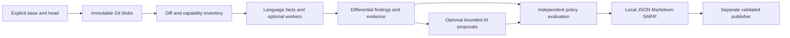

# PullRaptor product and architecture specification

Date: 2026-10-03. Status: proposed. This specification covers the product direction; the first child implementation plan covers E01 only. No implementation is authorized by task checkboxes or this document alone.

## 1. Product purpose

Help a developer or reviewer understand a change, find defensible problems, ask about the reasoning, and prepare a reviewable correction without operating a large service stack. Combine a useful PR workflow with local deterministic analysis and optional deeper reasoning. The user asked for broad modern features, mathematical rigor, minimal code/dependencies, independent design, and no competing names in project files. The user delegated selection of the best deployment combination after research.

Success requires evidence that the reviewer improves decisions at a tolerable noise, time, and resource cost. A larger feature list is insufficient. Do not claim superior accuracy, mathematical proof of arbitrary code, or exhaustive vulnerability detection.

## 2. Approaches considered

| Approach | Strength | Cost / limitation | Decision |
|---|---|---|---|
| Deterministic local kernel plus optional adapters | Reproducible, cheap, inspectable, offline base; reusable in CI | Narrow initial semantic coverage; AI features arrive later | Recommended |
| Hosted AI-first reviewer | Broad natural-language reasoning and convenient PR interaction | Service operations, credentials, source transfer, variable cost/results | Optional deployment later |
| Full analyzer/agent platform | Extensive tool and language breadth | Large dependencies, orchestration, licenses, resource requirements | Reject as core architecture |

For runtime, Python wins the first stage on authored-code simplicity and its built-in parser. Go is a good alternative if a compiled executable and Go-first analysis become more important than Python coverage. Rust would add implementation and packaging work without a demonstrated requirement. This recommendation is a design judgment; no comparative benchmark was run.

## 3. User flows

1. **Review locally:** choose base and head; receive a concise summary, newly detected findings, surviving baseline findings, and an explicit coverage section. No network or source execution.
2. **Review a PR:** CI analyzes the immutable PR revision; a separate publisher previews/posts a summary and up to ten new inline comments. Old findings remain linked to their original revision; repeats update lifecycle rather than spam.
3. **Explain or challenge:** later chat answers from the pinned report, source, and provided context. Each conversation stays bound to that report/head/context manifest; answers about later code require a new snapshot. A conflicting observation adds counterevidence or requests a new run. Dismissing a thread is feedback, not proof of a fix.
4. **Prepare a correction:** later patch generation returns a scoped diff and validation receipt. A draft can remain useful after failed verification, but must say failed or not run. Passing syntax/build checks is distinct from reproducing and correcting a baseline regression. Publish/commit is an explicit action; merge is outside the reviewer.

The source-level reports must be useful without diagrams, AI, a dashboard, or a platform account. Diagrams are optional bounded presentations of the same graph facts. Grouped changes show the edge/reason for grouping and distinguish dependency edges from presentation order. Missing edges mean impact was not established, not that impact is absent. Cycles/unknown edges fall back to a file walkthrough.

## 4. Core pipeline and boundaries

The kernel transforms immutable records. Snapshot reading, optional cache I/O, provider calls, publication, and execution workers are separate boundaries. AI returns proposals; only deterministic validators can grant the evidence class a proposal needs. Graph/context records do not become policy instructions.

Initial files are mapped in the child plan. Avoid generic plugin containers, inheritance-heavy frameworks, event buses, a server, and premature database abstractions. Keep simple functions with explicit input/output records. The optional cache is a performance feature and can be disabled without changing semantic output.

## 5. Revision and filesystem contract

- Resolve user refs to validated immutable Git object IDs before analysis. Use `merge-base(base_tip, head)` as the default PR comparison baseline, recording all three identities. `--exact-base` opts into direct base/head comparison.
- Multiple merge bases, missing/shallow history, unrelated histories, or missing objects produce an actionable incomplete/error result; do not guess. The offline kernel never fetches automatically.
- Read tree entries and blobs from Git objects, never import modules or execute files. Disable external diff, text conversion, fsmonitor, pager behavior, and replacement-object substitution; use argument arrays, fixed commands and an explicit sanitized Git environment. No shell interpretation or repository hooks.
- Use NUL-delimited tree/status metadata. Renames affect display and alignment, not file identity authority. Snapshot identity includes path, mode and blob identity. Decode source according to its encoding rules; do not silently replace undecodable bytes.
- Do not follow symlinks, initialize submodules, invoke filters, download large-file pointers, or expand archives. Record these exclusions. Binary files receive metadata-level review. Non-UTF-8 paths are explicitly unsupported in 0.1 and produce coverage diagnostics rather than disappearing.
- Dirty working-tree changes are excluded from E01 and noted in the report. E02's local-snapshot child package must materialize staged/unstaged content as immutable manifests, detect concurrent edits, and opt into untracked files explicitly. A mutable directory is not a snapshot.

## 6. Configuration and defaults

Trusted CI configuration comes from the base tip, with its blob digest recorded separately from the comparison merge base. Head changes are reviewed as proposed policy changes and cannot weaken their own review. Local configuration is an explicitly selected trusted input. Precedence: built-in defaults, trusted base TOML, explicit local overrides; CI refuses overrides that weaken required scope or thresholds.

Configuration is TOML, parsed through `tomllib`; unknown keys and invalid values are errors. Path filters are repository-relative glob patterns using a documented `fnmatchcase` contract, not platform-dependent shell expansion. Initially only `*`, `?`, and bracket classes are supported; `**` has no special recursive meaning. Paths always use `/` separators. Required source paths cannot be silently excluded by head content. Natural-language guidance is contextual data and cannot change executable permissions, provider destinations, rules, or blocking thresholds.

| Setting | E01 default / limit |
|---|---|
| profile | `structural`; `diff` must be explicit |
| runtime support | Python 3.12.x only in E01; parser patch version recorded exactly; other minor versions rejected until tested |
| runtime packages | zero third-party packages in deterministic kernel |
| files | at most 10,000 tracked entries per snapshot |
| blob bytes | at most 2,097,152 bytes per analyzed source blob |
| total bytes | at most 134,217,728 source bytes per snapshot |
| parse deadline | 2 seconds per blob, isolated child process |
| review deadline | 60 seconds total; partial receipt after exhaustion |
| cache | optional; at most 268,435,456 bytes; no source text, atomic JSON entries |
| AI | disabled; no provider credentials needed |
| reviewed-code execution | disabled |
| default rule blocking | none; all three initial rules are advisory |
| publication | disabled in local review |

Limits are operator-changeable trusted policy. Exceeding one creates incomplete coverage, never successful silent truncation. A parser child does not constitute a complete hostile-code sandbox; impose OS memory/CPU limits where supported, and require an isolated resource-limited CI runner for hostile inputs. Unsupported OS resource enforcement must be reported before making a hosted-security claim.

## 7. E01 language and rule contract

The `diff` profile provides exact changed-file/hunk facts and a deterministic walkthrough for text. It explicitly says semantic correctness and security were not evaluated.

The `structural` profile additionally analyzes changed and required related Python files within the implemented pattern scope. Requested structural analysis of other source languages is partial. Unsupported grammar, malformed input, decoding failure, process crash, timeout, or missing imported context remains visible. An empty findings list is not “clean code.” AST parsing alone is neither type checking nor whole-program analysis.

Three advisory rules establish factual patterns and describe consequences under assumptions:

| ID | Exact initial condition | Claim boundary |
|---|---|---|
| PY001 | Mutable list/dict/set literal default plus a direct mutation of the unreassigned parameter in that function's own scope | Default object can persist across omitted-argument calls; intentional caching is possible |
| PY002 | Bare exception handler with a straight-line body and optional terminal return, without any raise | Captures exception categories including interruption; intentional supervision is possible |
| PY003 | A statically resolved `subprocess` invocation with literal `shell=True` | Requests shell-use review; does not claim injection or attacker input |

Resolve local binding shadowing and supported imports. Ambiguous resolution prevents the rule claim and records a diagnostic. PY001 handles direct subscript writes and these type-specific methods: list `append/extend/insert/pop/remove/clear/sort/reverse`, dict `update/setdefault/pop/popitem/clear`, set `add/update/remove/discard/pop/clear`. Constructor calls, unknown rebinding and alias-mediated writes are outside 0.1. PY002 excludes nested/branching handler control flow; conditional reraises are not silently called swallowing. PY003 handles only resolved `subprocess.run/Popen/call/check_call/check_output`, excluding shadowed aliases and unresolved dynamic attribute calls.

Imported module facts are used for supported symbol/context resolution only. There is no interprocedural taint, authorization proof, or framework model in E01. Report capability labels `generic_diff`, `python_structure`, `python_patterns`; later workers may advertise `calls`, `cfg`, `dataflow`, or `auth_obligations` independently.

## 8. Report and decision contract

Report schema version 1 includes base tip, comparison base, head, runtime/rule/config digests, files/capabilities requested and examined, exclusions, diagnostics, findings, evidence references and profile. Each finding has a rule/version, precise claim, side-aware source span, severity, advisory/blocking policy class, semantic anchor, witness digest, support/refutation state, delta classification and assumptions. Span records retain AST UTF-8 byte offsets and computed decoded-character columns separately; format renderers must not reread a mutable working tree to compute locations.

Delta classes are `newly_detected`, `persisting`, `no_longer_detected`, and `unknown`. A separate `evidence_delta` is `added`, `unchanged`, `changed`, or `unknown`. “Newly detected” becomes “introduced” only if comparable baseline analysis and reliable root-cause alignment support that causal statement. “No longer detected” never automatically becomes “fixed.” Existing sinks with changed/new paths need fresh review even if their obligation persists; publication eligibility must examine the evidence delta.

Findings retain all distinct obligations even when their locations overlap. Newline shifts do not duplicate an otherwise identical root cause. Ambiguous alignment yields unknown. Local sorting is deterministic by policy class, severity, path, side, line, rule and fingerprint. The full result remains available when UI comment limits apply.

Evidence states are `undetermined`, `supported`, `refuted`, `conflicted`. Severity, evidence strength, coverage, and publication eligibility are separate. Initial supported evidence supports a pattern statement; it does not automatically support a defect statement.

Exit codes: `0` requested analysis complete with no configured blocking result, `1` complete with a configured blocker, `2` required analysis incomplete or unavailable, `3` tool/configuration/input failure. An optional advisory capability can be unavailable without failing an explicitly narrower requested profile, but the limitation must be in the report. Incomplete required analysis takes precedence over findings-based status. SARIF and Markdown reflect these semantics; consumers must not infer safety from the exit code or result count alone.

Canonical report data excludes timings, cache-hit counters, invocation timestamps and publisher IDs; these appear in an `execution` section. For completed logical analyses of the same inputs, canonical findings, scope, diagnostics and input manifests must match across clean and incremental runs. Wall-time exhaustion may make a cold run partial and a warm run complete; preserve each coverage receipt and do not claim equivalence until a complete clean comparison is available. Do not remove resource failures from the user-visible result to force equality.

## 9. Optional adapters

- **Language workers:** versioned JSON request/response over subprocess pipes; declared capabilities, pinned runtime/grammar, timeout and size caps. Per-language optional binding/grammar packages are allowed only outside the kernel. No automatic dependency installation.
- **AI:** one provider-neutral request interface, bounded context and output, no mandatory SDK, no autonomous browsing/tool execution. Later E03 defaults per review invocation or explicit chat answer: two requests, 65,536 serialized context bytes in aggregate, 2,048 requested output tokens per request, and 60 seconds aggregate including retries. Show used/remaining limits and require a deliberate trusted override for increases. Separate chat answers consume separate budgets; deployments also require an operator-set total spend cap. Bytes do not guarantee an input-token count. Provider prices, exact tokenization and retries require their own policy; display “cost unknown” when price data is absent. Preview transmitted paths and redact sensitive values; remote privacy cannot be guaranteed by a local filter. A valid source location proves only that the location exists; a behavioral claim remains a hypothesis until a matching deterministic or execution witness supports it.
- **CI context:** opt-in retrieval of exact-head run/job logs as bounded text with provider/run/commit provenance, size limits and redaction. Logs are untrusted context, cannot trigger command execution, and cannot substitute for a fresh validation run. Missing or stale logs remain explicit.
- **Scanner import:** a declared SARIF subset with producer/version/revision provenance. An imported claim preserves original trust; cross-tool agreement alone is not independent validation. Never execute tool names, links, commands or fixes embedded in a report.
- **Advisories:** opt-in lockfile lookup with endpoint allowlist, version/ecosystem matching, freshness receipt and no source upload. Installed version matching is distinct from exploitable code reachability.
- **Publisher:** validates report schema, repository/run/PR association, current head, locations and trusted severity thresholds. Posts data, never executes artifacts. Rechecks head immediately before publication and attaches the reviewed commit; a race produces an outdated result requiring a new run, not approval.
- **Runner:** separate E06 isolation design. Candidate tests and repository build scripts are untrusted executable code. Provider/publisher credentials never enter the runner. Patch validation targets the reviewed head tree, with old blob/mode preconditions for every changed path, an explicit allowed-path set, traversal/symlink escape rejection and stale-worktree refusal. Default proposals cannot edit workflow/policy files, executable bits, symlinks or submodules; exceptions require a distinct trusted action. A validation receipt pins patch digest, original/result tree, commands, runtime/image and test inputs. Renames/deletions need explicit support before acceptance.

## 10. CI and privacy design

Use an unprivileged analysis job and a narrowly privileged publisher. Install/run a pinned trusted reviewer artifact, not a package or workflow taken from the PR head. Verify artifact provenance using platform run metadata, expected repository, PR, workflow and head; checking attacker-supplied digests alone is insufficient. Bound JSON size/schema and render content as text. Untrusted forks receive report artifacts even when inline publication is unavailable.

Do not use a privileged target-branch workflow to execute head code. Keep publication credentials away from parsing, models and test runs. Publish only COMMENT feedback initially; no automatic approve or request-changes action. Missing permission or an API failure produces an explicit publication failure while retaining the local report.

Offline core egress is zero. Optional cache stores compact facts and receipts, not raw source or model prompts; those facts may still reveal names and architecture. Cache deletion is supported and disabling cache preserves behavior. Logs redact credential values and avoid source dumps. In-memory source and report evidence remain locally available; a remote adapter must explicitly declare its destinations and retention limits.

## 11. Verification and implementation boundary

The [mathematical core](../../mathematical-core.md) defines the formal contracts. The [evaluation contract](../../evaluation.md) defines their test and empirical gates. The [E01 implementation plan](../plans/2026-10-03-review-kernel.md) maps the first stage to exact modules and meaningful adverse tests. E02–E06 need smaller child specs and plans before execution. No broad capability is implemented by describing it here.
